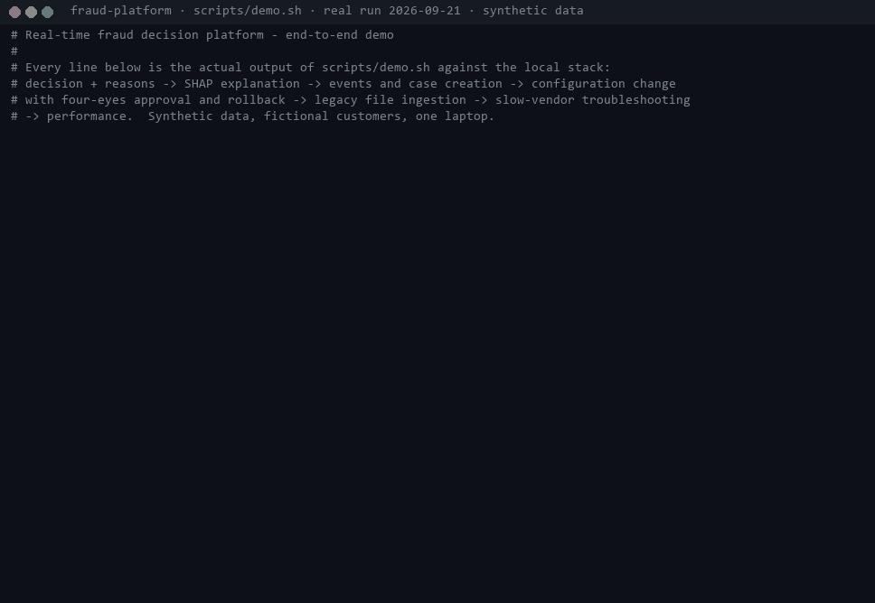
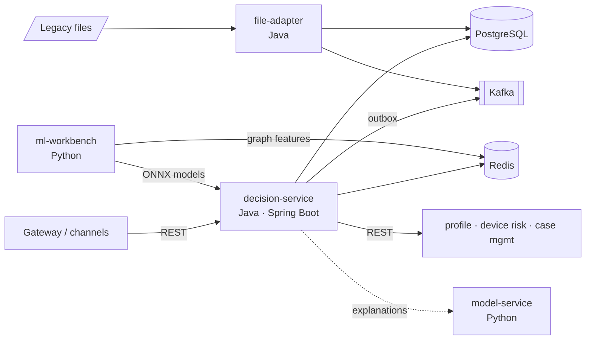

# Enterprise Fraud Risk Platform Implementation for a Digital Payments Customer

A portfolio project that simulates **delivering** a real-time fraud and risk-management solution to a
fictional mid-size bank (Aldermoor Bank) and configuring it for a second fictional customer (Quillon Pay).
It covers the full implementation lifecycle — discovery, design, build, integration, testing, migration,
go-live and support — not just a fraud model.

> **Honesty statement.** This is a personal learning and portfolio project. All customers, data, volumes,
> incidents and results are **synthetic or simulated**. It does not represent work for a real bank or
> payment provider and is **not production-ready**. Measured results are reported with the environment
> they were measured on; targets are labelled as targets.

## Demo (recorded run)



A real run of [`scripts/demo.sh`](scripts/demo.sh) against the local stack, recorded with
[`scripts/record-demo.py`](scripts/record-demo.py) — full timestamped output in
[docs/media/demo-transcript.txt](docs/media/demo-transcript.txt). Run it yourself:
**[step-by-step walkthrough](docs/DEMO_WALKTHROUGH.md)**.

## Status

| Stage | Scope | Status |
|---|---|---|
| 0 | Discovery, requirements, architecture, ADRs, repository structure | ✅ Done (proposal) |
| 1 | Python workbench: synthetic data generator (6 fraud typologies, 2 customers) | ✅ Done |
| 2 | Models: LR baseline, LightGBM, Isolation Forest, graph features, SHAP, ONNX export, evaluation, model-service | ✅ Done |
| 3 | Java decision service core: API, validation, idempotency, rules, ONNX inference, PostgreSQL, Redis | ✅ Done |
| 4 | Configuration & strategy management: versioning, validation, promotion, rollback, rollout | ✅ Done |
| 5 | Outbound REST integrations + downstream simulators (timeouts, retries, circuit breakers) | ✅ Done |
| 6 | Kafka events: outbox, consumers, DLT, replay | ✅ Done |
| 7 | File adapter: legacy files, validation, quarantine, reconciliation | ✅ Done |
| 8 | Observability, performance tests (k6), JVM performance guide — **measured** results | ✅ Done |
| 9 | Troubleshooting lab: 18 reproducible incidents with evidence — [playbook](docs/TROUBLESHOOTING_PLAYBOOK.md); found and fixed 4 real defects (Redis connection churn, model-less pod reported ready, consumer throughput, missing alerts) | ✅ Done |
| 10 | Kubernetes manifests (kustomize base + dev/prod overlays), deployed to a local kind cluster; AWS design mapping (not deployed) — [doc](docs/AWS_AND_KUBERNETES.md) | ✅ Done |
| 11 | Release 1.x → 2.0 migration implemented and rehearsed (expand/backfill/contract, rollback, backfill impact measured) — [runbook](docs/MIGRATION_AND_UPGRADE_RUNBOOK.md); go-live runbook, implementation plan, customer communication and 11 customer artifacts ([docs/customer/](docs/customer/)) | ✅ Done |
| 12 | Reusable assets and templates, engineering standards + mentoring exercise, runnable end-to-end demo (`scripts/demo.sh`) | ✅ Done |

## Architecture at a glance



Full design: [docs/ARCHITECTURE.md](docs/ARCHITECTURE.md) · Requirements: [docs/REQUIREMENTS_AND_ASSUMPTIONS.md](docs/REQUIREMENTS_AND_ASSUMPTIONS.md) · Decisions: [docs/adr/](docs/adr/)

## Repository structure

```text
.
├── README.md
├── docs/                         # project documents, ADRs, customer artifacts, templates, demo media
│   ├── adr/                      # architecture decision records
│   ├── customer/                 # questionnaire, status report, incident update, handover...
│   └── templates/                # reusable engineering templates
├── risk-platform/                # Java — Maven multi-module
│   ├── pom.xml
│   ├── platform-commons/         # event schemas, error model, integration-client template
│   ├── decision-service/         # Spring Boot: scoring API, strategy engine, ONNX, admin API, outbox, consumers
│   │   └── src/main/java/.../decision/
│   │       ├── api/              # controllers, DTOs, filters (auth, correlation ID), error mapping
│   │       ├── application/      # use cases + ports
│   │       ├── domain/           # Transaction, RiskDecision, ReasonCode, Signals
│   │       ├── strategy/         # strategy engine, rule DSL, thresholds, rollout
│   │       ├── inference/        # ONNX scorers, model registry
│   │       ├── features/         # velocity, graph features (Redis)
│   │       ├── persistence/      # JdbcClient repositories
│   │       ├── integration/      # profile / device-risk / case clients (Resilience4j)
│   │       ├── messaging/        # outbox relay, producers, consumers
│   │       ├── observability/    # metrics, logging, latency
│   │       └── config/           # Spring configuration
│   ├── file-adapter/             # Spring Boot: scheduled legacy file ingestion
│   └── downstream-simulators/    # fake customer systems with fault injection
├── ml-workbench/                 # Python — data generation, training, evaluation, export (runs in Docker)
│   ├── src/fraudlab/
│   ├── model_service/            # FastAPI: SHAP explanations, challenger scoring
│   └── tests/
├── config/customers/             # aldermoor-bank/, quillon-pay/ — strategy config per environment
├── models/                       # versioned model artifacts + manifests (generated)
├── data/                         # generated synthetic data (gitignored) + small samples
├── deploy/
│   ├── docker-compose.yml
│   ├── k8s/                      # kustomize base + overlays (dev = kind, prod = EKS design)
│   ├── prometheus/ grafana/      # alert rules, dashboards
├── perf/                         # k6 scripts and recorded results
├── troubleshooting-lab/          # 18 incident scripts + captured evidence
├── migration-rehearsal/          # release 2.0 migration rehearsal scripts + evidence
└── scripts/                      # demo and helper scripts
```

## Technology choices

| Area | Choice | Reason |
|---|---|---|
| Service language | Java 21 (compiled with JDK 25), Spring Boot 4.1, Maven | Enterprise standard |
| Persistence | PostgreSQL 16, Flyway, HikariCP, Spring `JdbcClient` | Explicit, explainable SQL ([ADR-006](docs/adr/ADR-006-jdbc-over-jpa.md)) |
| Feature store | Redis 7 | Low-latency counters with TTL ([ADR-003](docs/adr/ADR-003-postgres-plus-redis.md)) |
| Messaging | Kafka (KRaft) + transactional outbox | At-least-once, no dual writes ([ADR-002](docs/adr/ADR-002-transactional-outbox.md)) |
| Resilience | Resilience4j (timeouts, retries, circuit breakers, bulkheads) | Standard in Spring ecosystem |
| ML | Python 3.12 in Docker, scikit-learn, LightGBM, NetworkX, SHAP, ONNX | Reproducible, pinned environment |
| Inference | ONNX Runtime for Java, in-process | No network hop on hot path ([ADR-001](docs/adr/ADR-001-in-process-onnx-inference.md)) |
| Testing | JUnit 5, Mockito, Testcontainers, WireMock, pytest | Real dependencies in integration tests |
| Observability | Micrometer, Prometheus, Grafana, JSON logs | Standard, AWS-mappable |
| Load testing | k6 (run via Docker) | Scriptable, reproducible |

## Setup and demo

**Prerequisites:** Docker Desktop (≈ 8 GB for the full stack), JDK 21+, Maven 3.9+, Python 3.12 (only for the ML
workbench, which also runs in Docker). Tested on Windows 11 with Git Bash and Docker Desktop.

```bash
# 1. build the Java services and run all tests (96 tests; Testcontainers needs Docker)
(cd risk-platform && mvn -B verify)
# 2. start the stack: PostgreSQL, Redis, Kafka, simulators, model-service, decision-service, file-adapter, Prometheus, Grafana
docker compose -f deploy/docker-compose.yml up -d --build
# 3. seed customers, history and labels through the real file -> Kafka path
scripts/seed-demo.sh
# 4. run the 10-minute demo (lab profile needed for the troubleshooting step)
DECISION_PROFILES=lab docker compose -f deploy/docker-compose.yml up -d decision-service
scripts/demo.sh
```
Grafana: http://localhost:3000 · Prometheus: http://localhost:9090 · Scoring API: http://localhost:8080 (OpenAPI in
[docs/api/openapi-v1.yaml](docs/api/openapi-v1.yaml); dev API keys in the table below). Models and synthetic data are regenerated with `scripts/wb.sh` (ML workbench, see
[MODEL_STRATEGY.md](docs/MODEL_STRATEGY.md)). Kubernetes: `deploy/k8s/kind-up.sh`.

**Local development API keys** (only their SHA-256 hashes are in the configuration; never use outside a laptop):

| Key | Role |
|---|---|
| `dev-aldermoor-gateway-key` / `dev-quillon-gateway-key` | scoring |
| `dev-aldermoor-analyst-key` | analyst (decisions, explanations, cases) |
| `dev-aldermoor-admin-key` / `dev-quillon-admin-key` | admin (strategies, deployments, models, events) |
| `dev-aldermoor-approver-key` / `dev-quillon-approver-key` | second approver (four-eyes) |
| `dev-file-ops-key` | file-adapter operations |

**Demo flow** (`scripts/demo.sh`, about 10 minutes — [walkthrough](docs/DEMO_WALKTHROUGH.md)): real-time decision with reasons and
versions → SHAP explanation → outbox events and case creation → emergency configuration change with four-eyes
approval and rollback → legacy file ingestion (accepted and rejected) → slow-vendor troubleshooting → performance.

## Key results (measured on one laptop, synthetic data)

| Area | Result | Source |
|---|---|---|
| Latency | 150 TPS sustained, warm JVM: p95 15.2 ms, p99 40.1 ms, 0.017% errors; cold JVM fails (p95 327 ms) | [perf/README.md](perf/README.md) |
| Durability | 34,768 responses = 34,768 persisted decisions under dependency failures; 0 duplicate cases for 2,278 replayed events | perf, TS-08 |
| Detection (synthetic) | ML-only PR-AUC 0.748; hybrid incident recall 0.84 → 0.99; unseen ATO ~18% → ~39% | [MODEL_STRATEGY.md](docs/MODEL_STRATEGY.md) |
| Defects found by investigation | Redis connection churn (port exhaustion at ~157 rps), model-less pod reported ready, broker coordinator stall, Kubernetes service-link crash, migration backfill hurting p99 ×14 | [ENGINEERING_JOURNAL.md](docs/ENGINEERING_JOURNAL.md) (39 entries) |
| Tests | 96 Java tests (unit, integration with Testcontainers, contract, parity), 23 Python tests | CI-less; run locally |

## Documents

| Topic | Documents |
|---|---|
| Purpose, context, requirements | [PROJECT_PURPOSE](docs/PROJECT_PURPOSE.md) · [BUSINESS_CONTEXT](docs/BUSINESS_CONTEXT.md) · [REQUIREMENTS_AND_ASSUMPTIONS](docs/REQUIREMENTS_AND_ASSUMPTIONS.md) |
| Design | [ARCHITECTURE](docs/ARCHITECTURE.md) · [ADRs](docs/adr/) · [DATABASE_DESIGN](docs/DATABASE_DESIGN.md) · [MODEL_STRATEGY](docs/MODEL_STRATEGY.md) · [CONFIGURATION_AND_RISK_STRATEGY](docs/CONFIGURATION_AND_RISK_STRATEGY.md) |
| Integrations | [API_INTEGRATIONS](docs/API_INTEGRATIONS.md) · [MESSAGING_AND_EVENTS](docs/MESSAGING_AND_EVENTS.md) · [FILE_INTEGRATIONS](docs/FILE_INTEGRATIONS.md) |
| Demo | [DEMO_WALKTHROUGH](docs/DEMO_WALKTHROUGH.md) · [recording transcript](docs/media/demo-transcript.txt) |
| Runtime and operations | [REAL_TIME_ENGINEERING](docs/REAL_TIME_ENGINEERING.md) · [JAVA_PERFORMANCE_GUIDE](docs/JAVA_PERFORMANCE_GUIDE.md) · [OBSERVABILITY_AND_OPERATIONS](docs/OBSERVABILITY_AND_OPERATIONS.md) · [TROUBLESHOOTING_PLAYBOOK](docs/TROUBLESHOOTING_PLAYBOOK.md) · [SUPPORT_MODEL](docs/SUPPORT_MODEL.md) · [AWS_AND_KUBERNETES](docs/AWS_AND_KUBERNETES.md) |
| Delivery | [CUSTOMER_IMPLEMENTATION_PLAN](docs/CUSTOMER_IMPLEMENTATION_PLAN.md) · [MIGRATION_AND_UPGRADE_RUNBOOK](docs/MIGRATION_AND_UPGRADE_RUNBOOK.md) · [GO_LIVE_RUNBOOK](docs/GO_LIVE_RUNBOOK.md) · [CUSTOMER_COMMUNICATION](docs/CUSTOMER_COMMUNICATION.md) · [customer artifacts](docs/customer/) |
| Team | [REUSABLE_ENGINEERING_ASSETS](docs/REUSABLE_ENGINEERING_ASSETS.md) · [templates](docs/templates/) · [MENTORING_AND_ENGINEERING_STANDARDS](docs/MENTORING_AND_ENGINEERING_STANDARDS.md) · [ENGINEERING_JOURNAL](docs/ENGINEERING_JOURNAL.md) |

## Limitations

* **Synthetic data and fictional customers.** Detection results show the method, not real-world performance.
* **One laptop.** Latency numbers do not transfer to production hardware; CPU cost per request roughly does. No
  multi-node or multi-AZ failure testing.
* **Not deployed to AWS.** The AWS architecture is a design; Kubernetes was verified on a local kind cluster only.
* **Not production-ready:** no security review, API keys instead of OAuth2/mTLS, no infrastructure as code, no 8-hour
  soak test, stress-test knee not re-measured after the J-26 fix, known issues listed in
  [SUPPORT_MODEL.md](docs/SUPPORT_MODEL.md).
* **Load-test data** replays a small customer pool, which inflates velocity features and the REVIEW share (J-28).
