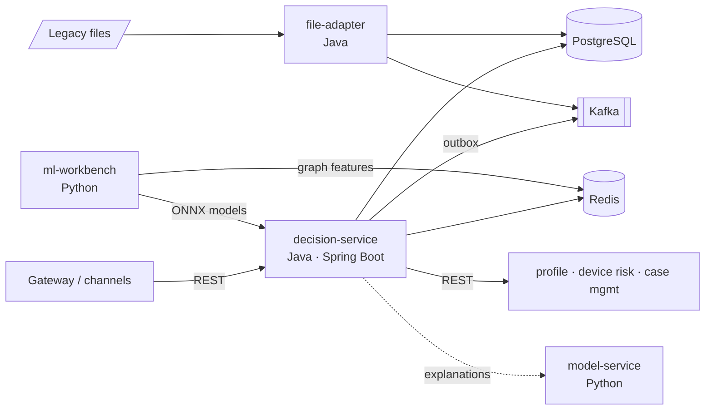

# Enterprise Fraud Risk Platform Implementation for a Digital Payments Customer

A portfolio project that simulates **delivering** a real-time fraud and risk-management solution to a
fictional mid-size bank (Aldermoor Bank) and configuring it for a second fictional customer (Quillon Pay).
It covers the full implementation lifecycle — discovery, design, build, integration, testing, migration,
go-live and support — not just a fraud model.

> **Honesty statement.** This is a personal learning and portfolio project. All customers, data, volumes,
> incidents and results are **synthetic or simulated**. It does not represent work for a real bank or
> payment provider and is **not production-ready**. Measured results are reported with the environment
> they were measured on; targets are labelled as targets.

## Status

| Stage | Scope | Status |
|---|---|---|
| 0 | Discovery, requirements, architecture, ADRs, repository structure | ✅ Done (proposal) |
| 1 | Python workbench: synthetic data generator (6 fraud typologies, 2 customers) | ✅ Done |
| 2 | Models: LR baseline, LightGBM, Isolation Forest, graph features, SHAP, ONNX export, evaluation, model-service | ✅ Done |
| 3 | Java decision service core: API, validation, idempotency, rules, ONNX inference, PostgreSQL, Redis | ✅ Done |
| 4 | Configuration & strategy management: versioning, validation, promotion, rollback, rollout | ✅ Done |
| 5 | Outbound REST integrations + downstream simulators (timeouts, retries, circuit breakers) | ✅ Done |
| 6 | Kafka events: outbox, consumers, DLT, replay | ✅ Done |
| 7 | File adapter: legacy files, validation, quarantine, reconciliation | ✅ Done |
| 8 | Observability, performance tests (k6), JVM performance guide — **measured** results | Planned |
| 9 | Troubleshooting lab: 18 reproducible incidents | Planned |
| 10 | Docker Compose, Kubernetes manifests, AWS mapping | Planned |
| 11 | Lifecycle: migration v1→v2, go-live, support, customer communication | Planned |
| 12 | Reusable assets, engineering standards, mentoring, interview preparation | Planned |

## Architecture at a glance



Full design: [docs/ARCHITECTURE.md](docs/ARCHITECTURE.md) · Requirements: [docs/REQUIREMENTS_AND_ASSUMPTIONS.md](docs/REQUIREMENTS_AND_ASSUMPTIONS.md) · Decisions: [docs/adr/](docs/adr/)

## Repository structure (target)

```text
.
├── README.md
├── docs/                         # 26 project documents, ADRs, customer artifacts, templates
│   ├── adr/                      # architecture decision records
│   ├── customer/                 # questionnaire, status report, incident update, handover...
│   └── templates/                # reusable engineering templates
├── risk-platform/                # Java — Maven multi-module
│   ├── pom.xml
│   ├── platform-commons/         # event schemas, error model, integration-client template
│   ├── decision-service/         # Spring Boot: scoring API, strategy engine, ONNX, admin API, outbox, consumers
│   │   └── src/main/java/.../decision/
│   │       ├── api/              # controllers, DTOs, filters (auth, correlation ID), error mapping
│   │       ├── application/      # use cases + ports
│   │       ├── domain/           # Transaction, RiskDecision, ReasonCode, Signals
│   │       ├── strategy/         # strategy engine, rule DSL, thresholds, rollout
│   │       ├── inference/        # ONNX scorers, model registry
│   │       ├── features/         # velocity, graph features (Redis)
│   │       ├── persistence/      # JdbcClient repositories
│   │       ├── integration/      # profile / device-risk / case clients (Resilience4j)
│   │       ├── messaging/        # outbox relay, producers, consumers
│   │       ├── observability/    # metrics, logging, latency
│   │       └── config/           # Spring configuration
│   ├── file-adapter/             # Spring Boot: scheduled legacy file ingestion
│   └── downstream-simulators/    # fake customer systems with fault injection
├── ml-workbench/                 # Python — data generation, training, evaluation, export (runs in Docker)
│   ├── src/fraudlab/
│   ├── model_service/            # FastAPI: SHAP explanations, challenger scoring
│   └── tests/
├── config/customers/             # aldermoor-bank/, quillon-pay/ — strategy config per environment
├── models/                       # versioned model artifacts + manifests (generated)
├── data/                         # generated synthetic data (gitignored) + small samples
├── deploy/
│   ├── docker-compose.yml
│   ├── k8s/                      # base + overlays (dev/staging/prod)
│   └── aws/                      # AWS mapping notes
├── perf/                         # k6 scripts and recorded results
├── troubleshooting-lab/          # incident reproduction scripts and fault toggles
└── scripts/                      # demo and helper scripts
```

## Technology choices

| Area | Choice | Reason |
|---|---|---|
| Service language | Java 21 (compiled with JDK 25), Spring Boot 3.x, Maven | Enterprise standard; matches role |
| Persistence | PostgreSQL 16, Flyway, HikariCP, Spring `JdbcClient` | Explicit, explainable SQL ([ADR-006](docs/adr/ADR-006-jdbc-over-jpa.md)) |
| Feature store | Redis 7 | Low-latency counters with TTL ([ADR-003](docs/adr/ADR-003-postgres-plus-redis.md)) |
| Messaging | Kafka (KRaft) + transactional outbox | At-least-once, no dual writes ([ADR-002](docs/adr/ADR-002-transactional-outbox.md)) |
| Resilience | Resilience4j (timeouts, retries, circuit breakers, bulkheads) | Standard in Spring ecosystem |
| ML | Python 3.12 in Docker, scikit-learn, LightGBM, NetworkX, SHAP, ONNX | Reproducible, pinned environment |
| Inference | ONNX Runtime for Java, in-process | No network hop on hot path ([ADR-001](docs/adr/ADR-001-in-process-onnx-inference.md)) |
| Testing | JUnit 5, Mockito, Testcontainers, WireMock, pytest | Real dependencies in integration tests |
| Observability | Micrometer, Prometheus, Grafana, JSON logs | Standard, AWS-mappable |
| Load testing | k6 (run via Docker) | Scriptable, reproducible |

## Setup and demo

Filled in as stages are implemented. Prerequisites: Docker Desktop, JDK 21+, Maven 3.9+.
