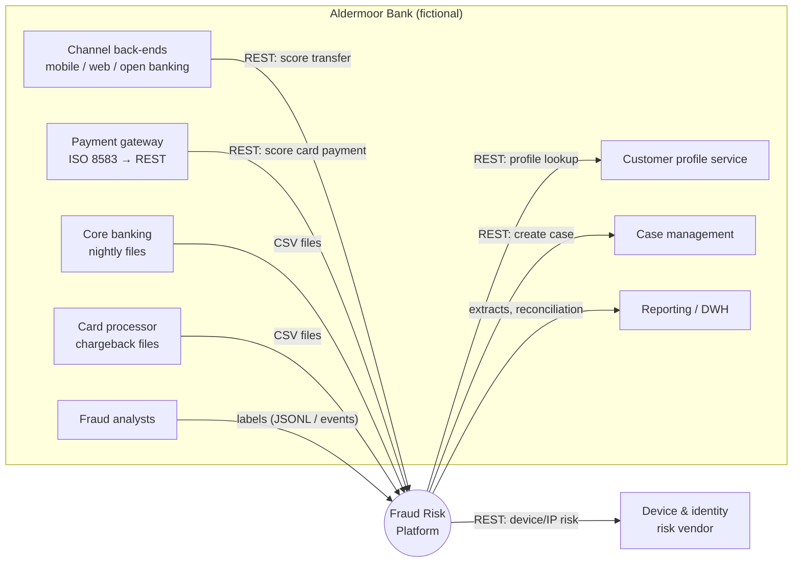
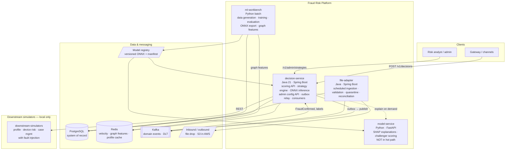
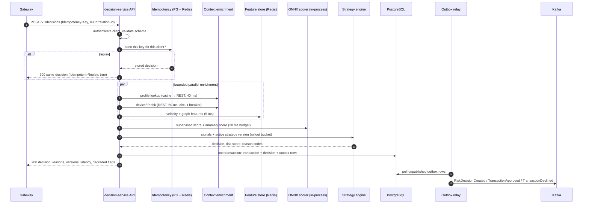
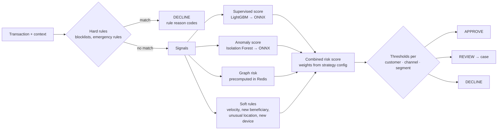

# Architecture

> **Status: v0.1 — proposed (Stage 0).** This document describes the target design. Sections are
> marked **[planned]** until the corresponding stage is implemented and tested; the README stage
> tracker is the source of truth for what exists.

## 1. Design goals

1. **Fast, bounded decisions.** The caller always gets an answer within a hard deadline, even when
   dependencies fail.
2. **Explainable decisions.** Every decision carries reason codes, strategy version and model version.
3. **Configuration over code.** Customer risk strategies are versioned data, validated and promoted
   through environments.
4. **No silent data loss.** Decisions and events are persisted before they are published.
5. **Integrate what the customer actually has.** REST for modern systems, events for the backbone,
   files for legacy systems.
6. **Operable.** Every failure mode is visible in logs and metrics and has a runbook entry.

## 2. System context

## 3. Containers

| Container | Responsibility | Why separate |
|---|---|---|
| `decision-service` | Synchronous scoring, strategy engine, admin API, outbox relay, event consumers | Owns the latency-critical path; one deployable keeps the hot path simple |
| `file-adapter` | Batch/legacy file integration | Different scaling and failure profile (throughput, not latency); must not compete for scoring threads |
| `model-service` | SHAP explanations, challenger/shadow scoring | Python ecosystem needed for SHAP; kept off the hot path |
| `ml-workbench` | Offline data generation, training, evaluation, export, graph feature job | Batch, reproducible, not a running service |
| `downstream-simulators` | Stand-ins for the customer's profile, device-risk and case systems | Makes integration failures reproducible (latency, errors, timeouts) |

## 4. Real-time scoring flow

### 4.1 Latency budget (design, per request)

| Step | Budget | On breach |
|---|---|---|
| Auth + validation + idempotency check | 5 ms | — |
| Profile lookup (Redis cache, REST on miss) | 40 ms | Use cached/default segment, flag `PROFILE_UNAVAILABLE` |
| Device/IP risk (REST) | 60 ms | Treat device as unknown, flag `DEVICE_RISK_UNAVAILABLE` |
| Velocity + graph features (Redis) | 5 ms | Velocity from PostgreSQL fallback query or skip, flag degraded |
| Model inference (ONNX, in-process) | 20 ms | Rules-only fallback strategy, flag `MODEL_UNAVAILABLE` |
| Strategy evaluation | 2 ms | — |
| Persist (single DB transaction) | 20 ms | Fail request (5xx) — a decision that cannot be recorded is not returned |
| **Total internal deadline** | **≤ 150 ms typical, 300 ms hard** | Deadline guard returns fallback decision |

The three enrichment calls run in parallel, so the critical path is the slowest of them, not the sum.

## 5. Decision logic (hybrid)

- **Hard rules** short-circuit (blocked device, emergency BIN block).
- **Soft rules** add score points and reason codes; they never decide alone unless configured to.
- **Thresholds** are per customer, channel and segment, versioned in the strategy configuration.
- **Reason codes** are ranked by contribution (rule points, SHAP-style model contribution from the
  exported feature importance, graph/anomaly thresholds).

## 6. Failure handling and fallback modes

| Failure | Detection | Behaviour | Reason / flag |
|---|---|---|---|
| Model load/inference failure or timeout | exception, deadline | Rules-only fallback strategy with conservative thresholds | `MODEL_UNAVAILABLE` |
| Redis unavailable | connection error, circuit open | Skip graph features; velocity via indexed PostgreSQL query (bounded) | `FEATURE_STORE_DEGRADED` |
| Device-risk vendor slow/down | timeout, circuit open | Device treated as unknown (not high risk) | `DEVICE_RISK_UNAVAILABLE` |
| Profile service down | timeout, circuit open | Last cached profile, else default segment | `PROFILE_UNAVAILABLE` |
| Kafka down | publish failure | Outbox rows accumulate; relay retries; scoring unaffected | outbox lag metric |
| PostgreSQL down | connection timeout | Readiness fails; requests fail fast (503) — gateway applies its own stand-in policy | — |

Per-channel **fail policy** is configuration: e.g. low-value card payments fail open to APPROVE,
high-value A2A transfers fail to REVIEW.

## 7. Configuration and strategy management [planned — Stage 4]

- Strategy = versioned JSON document per customer: thresholds, weights, rules (declarative DSL),
  lists, channel policies, segments, fail policies, model version, rollout percentage.
- Lifecycle: `DRAFT → VALIDATED → ACTIVE(env)`; promotion dev → staging → prod; previous version
  retained for one-step rollback.
- Rollout: deterministic hash of `customerId` → bucket 0–99; buckets below the rollout percentage use
  the candidate version (champion/challenger).
- Every change writes an audit event and publishes `ConfigurationChanged`.

## 8. Events [planned — Stage 6]

Kafka topics (keyed by `accountId` to keep per-account ordering): `transactions.received`,
`risk.decisions`, `cases.created`, `fraud.labels`, `platform.config-changes`, `platform.model-promotions`,
plus a `.dlt` topic per consumer group. Delivery: at-least-once via transactional outbox; consumers
are idempotent using a processed-events table.

## 9. Data stores

| Store | Used for | Why |
|---|---|---|
| PostgreSQL | Transactions, decisions, strategies, audit, cases, outbox, file-ingestion runs, reconciliation | ACID, constraints, rich SQL for investigations and reconciliation |
| Redis | Velocity windows (sorted sets), precomputed graph features, profile cache, idempotency fast path | Sub-millisecond reads with TTLs; losing it degrades quality, not correctness |
| Files (local dir / S3) | Legacy inbound/outbound files, quarantine, reports | Matches what legacy systems can produce |
| Model registry (dir / S3) | Versioned ONNX artifacts + manifest (hash, features, metrics) | Immutable, reproducible model versions |

## 10. Key design decisions

Recorded as ADRs in [`docs/adr/`](adr/):

| ADR | Decision |
|---|---|
| [ADR-001](adr/ADR-001-in-process-onnx-inference.md) | Hot-path model inference in-process via ONNX Runtime for Java; Python service only for explanations/challenger |
| [ADR-002](adr/ADR-002-transactional-outbox.md) | Transactional outbox + Kafka for at-least-once event delivery |
| [ADR-003](adr/ADR-003-postgres-plus-redis.md) | PostgreSQL as system of record, Redis as a degradable feature store |
| [ADR-004](adr/ADR-004-declarative-rule-dsl.md) | Declarative JSON rule DSL instead of scripting for customer rules |
| [ADR-005](adr/ADR-005-precomputed-graph-features.md) | Graph risk precomputed in near-real-time batch, looked up online |
| [ADR-006](adr/ADR-006-jdbc-over-jpa.md) | Spring `JdbcClient` with explicit SQL instead of JPA in the decision service |

## 11. Local vs production

| Concern | Local (implemented target) | Production on AWS (documented only) |
|---|---|---|
| Compute | Docker Compose | EKS (or ECS Fargate), multi-AZ, HPA |
| PostgreSQL | Container | Amazon RDS for PostgreSQL, Multi-AZ, read replica for reporting |
| Redis | Container | ElastiCache for Redis, cluster mode, Multi-AZ |
| Kafka | Single-node KRaft container | Amazon MSK, 3 brokers, RF=3 |
| Files | Mounted directory | S3 buckets with event notifications, lifecycle rules |
| Secrets | `.env` file (dev only) | AWS Secrets Manager via External Secrets / CSI driver |
| Observability | Prometheus + Grafana containers, JSON logs to stdout | CloudWatch Logs / Container Insights, Amazon Managed Prometheus/Grafana |
| Auth | API key filter | API Gateway / ALB with OAuth2 client credentials or mTLS |
