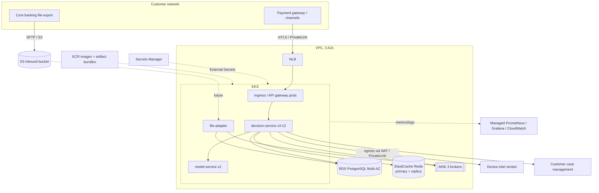

# AWS and Kubernetes

> **Status.** The Kubernetes manifests in [`deploy/k8s/`](../deploy/k8s/) are implemented and validated: rendered
> with kustomize (`kubectl kustomize`) and checked against the Kubernetes 1.33 schemas with kubeconform (0 invalid;
> the ExternalSecret CRD skipped). The dev overlay was also deployed to a local **kind** cluster (see
> [Local verification](#local-verification-kind)). **Nothing has been deployed to AWS.** The AWS architecture
> below is a design mapping with placeholder account IDs and endpoints, sized from the local measurements where
> possible and clearly marked where it is an assumption.

## 1. From Compose to Kubernetes

| Compose (local lab) | Kubernetes base | AWS (target design) |
|---|---|---|
| `decision-service` container, 2 vCPU | Deployment, 3–12 replicas, HPA, PDB, spread over zones | EKS managed node group (m7i / m7g), 3 AZs |
| `file-adapter` + bind-mounted folder | Deployment (1 replica, Recreate) + PVC | EKS + EBS gp3; future: S3 + event notification (code change, not implemented) |
| `model-service` | Deployment (2 replicas), no HPA | EKS |
| `postgres` | not in base (dev overlay only) | RDS PostgreSQL 16, Multi-AZ, encrypted, PITR |
| `redis` | not in base (dev overlay only) | ElastiCache Redis, primary + replica, automatic failover, TLS |
| `kafka` (single broker) | not in base (dev overlay only) | MSK, 3 brokers / 3 AZs, TLS, replication factor 3 |
| `models/`, `config/` volumes | **artifact-bundle** init container (versioned image) | ECR image; alternative: S3 sync in the init container |
| env vars in compose | ConfigMap + Secret | ConfigMap + External Secrets Operator → Secrets Manager |
| Prometheus / Grafana containers | scrape annotations; alert rules reused | Amazon Managed Prometheus + Managed Grafana, or the in-cluster stack |
| JSON logs to stdout | unchanged | Fluent Bit → CloudWatch Logs / OpenSearch |
| `/dumps` bind mount | `emptyDir` (2 GiB) | emptyDir + upload to S3 via IRSA role (open item: uploader sidecar) |

## 2. Manifests (what each setting is based on)

```text
deploy/k8s/
├── base/                    decision-service, file-adapter, model-service, config (no stateful dependencies)
└── overlays/
    ├── dev/                 kind: 1 replica, in-cluster Postgres/Redis/Kafka/simulators, generated dev secret
    └── prod/                EKS: managed endpoints, TLS, External Secrets, IRSA, ECR images, gp3
```

| Setting | Value | Evidence / reason |
|---|---|---|
| CPU request | 1 vCPU per pod | 11.7 CPU-ms per request (Stage 8 calibration) → ~85 rps per vCPU at 100%; HPA targets 60% |
| CPU limit | **none** | CFS throttling adds latency spikes to GC/JIT bursts on a latency-critical JVM; capacity is governed by requests, HPA and admission control |
| Memory | request = limit = 1536 MiB, `MaxRAMPercentage=70` | no overcommit; heap ≈ 1 GiB leaves room for metaspace, threads, direct buffers (TS-04: heap OOM, not container OOM) |
| `startupProbe` | up to 180 s | boot + model load + `WarmUpRunner` happen before readiness (J-13) |
| Readiness | db, redis, models, strategies | an instance without its model is not ready (J-29, TS-16) |
| Liveness | JVM only (`livenessState`) | a dependency outage must never cause restart storms |
| Rolling update | `maxSurge: 1`, `maxUnavailable: 0` | a failed rollout stalls without reducing capacity (TS-16) |
| `preStop` sleep 10 s + graceful shutdown 25 s | grace period 45 s | endpoints drop the pod before Tomcat stops accepting |
| HPA | min 3, max 12, CPU 60%; fast scale-up, 10 min scale-down stabilisation | cold pods cost CPU for minutes (C2 JIT, J-22 / TS-15): scale before saturation, avoid flapping |
| PDB | `minAvailable: 2` | node drains keep scoring capacity |
| Topology spread | zone + host | an AZ failure removes at most one third |
| Security | non-root UID 999, read-only root FS, no capabilities, seccomp `RuntimeDefault`, SA token not mounted, NetworkPolicy | written for Pod Security "restricted" (label on the prod namespace); admission not tested locally |
| Stateful services | not in base | managed services in AWS; dev overlay has single-pod versions for kind only |

**Database migrations.** Flyway runs at application startup and takes a PostgreSQL advisory lock, so parallel
pods are safe. For production, the recommended option is a pre-deployment Job (same image, migrate-only
mode) gated in the pipeline, so that a failed migration (TS-17) blocks the rollout before any pod starts. That
migrate-only mode is **not implemented**; the pipeline design is in MIGRATION_AND_UPGRADE_RUNBOOK.md.

**Model and configuration artifacts.** Models and customer strategies ship as an immutable, versioned image
(`deploy/docker/artifact-bundle.Dockerfile`) copied into an `emptyDir` by an init container. Promoting a
model set means changing one tag, and rolling back means the previous tag. At runtime, strategy activation
still happens through the admin API (database + audit); the bundle only provides the files the service
bootstraps from.

## 3. AWS target architecture (design, not deployed)



### Sizing (starting point, to validate with a load test in the target environment)

| Component | Assumption | Starting size |
|---|---|---|
| decision-service | peak 300 TPS per customer (assumption), 11.7 CPU-ms/request measured locally | 300 × 11.7 ms ≈ 3.5 vCPU at 100% → at 60% target ≈ 6 vCPU → 6 pods × 1 vCPU (min 3 off-peak) |
| RDS | ~1 write transaction per decision (decision + outbox + idempotency key) | db.r7g.large Multi-AZ, gp3; revisit after measuring IOPS |
| ElastiCache | 3 pipelined round trips per decision; feature keys ~31k per tenant in the lab | cache.r7g.large, 1 replica |
| MSK | outbox events ≤ 2 per decision | kafka.m7g.large × 3, RF 3, `min.insync.replicas=2` |

**Caveat.** Local numbers come from one laptop (Docker Desktop, 2 vCPU). CPU-ms per request is the most
transferable figure; latency percentiles are not. The first task in a real environment is to repeat the
baseline and stress tests there (the harness in `perf/` is environment-independent).

### Resilience mapping (from the troubleshooting lab)

| Failure (lab incident) | AWS mitigation |
|---|---|
| Redis loss (TS-12, TS-18) | ElastiCache Multi-AZ failover; `FeatureStoreWritesSkipped` / `ReviewShareDrift` alerts; rebuild runbook |
| Kafka coordinator fault (TS-07a) | MSK managed brokers, RF 3; `CaseCreationStalled` alert |
| Pod OOM (TS-04) | Kubernetes restarts; ≥ 3 replicas; PDB; heap dumps to S3 |
| Bad deployment (TS-16) | readiness gates; `maxUnavailable: 0`; automated rollback on failed smoke test (pipeline) |
| Broken migration (TS-17) | pre-deploy migration Job + snapshot test; RDS PITR as last resort |
| Slow vendor (TS-06) | per-dependency budgets and breakers (in code); VPC endpoints / PrivateLink where available |
| AZ failure | topology spread, Multi-AZ RDS / ElastiCache / MSK |

### Security and compliance notes (design)

* Data in transit: TLS everywhere (RDS `sslmode=verify-full`, ElastiCache TLS, MSK TLS); mTLS with the customer
  gateway.
* Data at rest: KMS encryption for RDS, ElastiCache, MSK, S3, EBS.
* Identity: IRSA per service (least privilege: the decision service only writes to the dumps bucket).
* Secrets: Secrets Manager with rotation; rotation runbook includes a rolling restart (TS-16 A showed what a
  rotated-but-not-updated secret does).
* PCI DSS scope: card tokens only (no PAN) in this design; network segmentation via NetworkPolicy + security
  groups. A real assessment is out of scope for this project.

## 4. Local verification (kind)

Script: [`deploy/k8s/kind-up.sh`](../deploy/k8s/kind-up.sh) (kind v0.30.0, single node). Evidence:
[`troubleshooting-lab/evidence/k8s-kind/`](../troubleshooting-lab/evidence/k8s-kind/).

**First deployment: three failures that schema validation could not catch** (all fixed in the manifests):

| Pod | Symptom | Cause | Fix |
|---|---|---|---|
| decision-service | CrashLoopBackOff: `Failed to bind properties under 'spring.data.redis.port'` | Kubernetes injects service-link variables: the Service `redis` creates `REDIS_PORT=tcp://10.96.x.x:6379`, which overrides the app's `${REDIS_PORT:6379}` | `enableServiceLinks: false` on every pod |
| file-adapter | JVM did not start: `Error opening log file '/dumps/gc.log': Read-only file system` | image writes the GC log to `/dumps`; read-only root FS and no volume there | `dumps` emptyDir |
| simulators | `resource path [/../../data/samples/threat_feed_ips.txt] … not valid` | relied on a compose bind mount | ConfigMap generated from the file + `THREAT_FEED` env |

After the fixes all 7 pods were Running and ready, and an in-cluster request to `POST /v1/decisions` returned
HTTP 200 (APPROVE, no degraded modes, 212 ms including a cold JVM).

**Bad rollout on Kubernetes (TS-16 B, after the J-29 fix).** `kubectl set env deploy/decision-service
MODELS_DIR=/app/models-v2`:
* the new pod stayed `0/1 Running`: `Readiness probe failed: HTTP probe failed with statuscode: 503` (24 × in
  118 s); its EndpointSlice entry was `ready=false`, so it received no traffic;
* the old pod stayed `1/1`, and the Service answered HTTP 200 throughout (`maxUnavailable: 0`);
* `kubectl rollout status` timed out (a pipeline would fail the deployment here); `kubectl rollout undo` restored
  the previous ReplicaSet.

**Not verified locally:** HPA and PDB (removed in the dev overlay: single node, no metrics-server);
NetworkPolicy enforcement (kind's default CNI does not enforce policies — the objects are applied but their
effect was not tested); the prod overlay (ExternalSecret, IRSA, managed endpoints) beyond rendering and schema
validation; Pod Security "restricted" admission (only labelled on the prod namespace).

## 5. Limitations and future improvements

* Not deployed to AWS; no Terraform/CDK (a natural next step: VPC, EKS, RDS, ElastiCache, MSK modules).
* The migrate-only mode for a pre-deployment Job is not implemented.
* File ingestion from S3 (instead of a PVC) is not implemented.
* No heap-dump uploader sidecar; dumps live in an `emptyDir` and are lost with the pod.
* HPA on CPU only; a custom metric (in-flight requests or admission rejections) would react better to latency.
* No service mesh; mTLS between services would come from a mesh or from application TLS.
