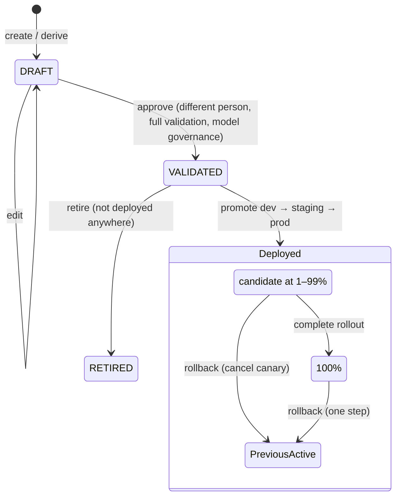

# Configuration and Risk Strategy

> Implemented in Stage 4. Customers and figures are fictional; evaluation numbers come from
> synthetic data (see [MODEL_STRATEGY.md](MODEL_STRATEGY.md)).

## 1. Principle: configuration is versioned data, not code

The platform code is identical for every customer. A customer's risk appetite lives in a **strategy
version**: a JSON document validated against a whitelist, stored immutably with a checksum, promoted
through environments and fully audited. Changing a threshold never requires a build or a deploy.

What is configurable per customer:

| Area | Strategy field | Example |
|---|---|---|
| Risk thresholds | `thresholds.default` | review 0.40, decline 0.90 |
| Customer segments | `thresholds.bySegment` | premium customers reviewed at 0.50 |
| Channel policies | `thresholds.byChannel`, `channelPolicies` | branch transfers reviewed at 0.60; POS fails open up to €250 |
| Signal weights | `weights` | model 1.0, rules 0.7, graph 0.4, anomaly 0.4 |
| Anomaly sensitivity | `anomaly.tailStartPercentile` | 0.99 |
| Velocity limits | rules on `card_txn_count_10m`, `device_txn_count_1h`, … | ≥ 3 card payments in 10 min |
| Merchant categories | `lists.highRiskMcc` + rules | electronics, jewellery, crypto |
| High-risk countries | `lists.highRiskCountries` + emergency rule | sanctioned jurisdictions declined |
| Trusted / blocked devices | `lists.trustedDevices`, `lists.blockedDevices` | emergency device block |
| New-beneficiary policy | policy rule with `action: REVIEW` | first transfer ≥ €5,000 always reviewed |
| Review rules | rules with `action: REVIEW` | minimum decision regardless of score |
| Emergency rules | `emergencyRules` | block a compromised device/BIN within minutes |
| Model versions | `model.version`, `model.challengerVersion` | champion + shadow challenger |
| Rollout percentages | deployment `rolloutPercentage` | canary 10% → 50% → 100% |

## 2. The rule DSL

```json
{ "id": "BEN-001", "description": "New beneficiary with high amount from a new device",
  "points": 40, "reasonCode": "NEW_BENEFICIARY",
  "when": { "all": [ { "field": "is_new_beneficiary", "op": "eq",  "value": 1 },
                     { "field": "amount_to_baseline", "op": "gte", "value": 3 },
                     { "field": "is_new_device",      "op": "eq",  "value": 1 } ] } }
```

* Conditions: `all`, `any`, `not`, and leaves `{field, op, value}`.
* Operators: `eq neq gt gte lt lte between in not_in in_list not_in_list`.
* Fields: a whitelist (`FieldCatalog`) — the 27 model features, raw transaction fields, segment and
  risk signals. Unknown fields are rejected.
* Actions: `SCORE` (adds points), `REVIEW` / `DECLINE` (minimum decision).
* A leaf on a missing value is **false** for every operator (same in Java and Python).
* Validation reports **all** errors at once (unknown fields, type mismatches, undefined lists,
  review ≥ decline, weights outside [0,1], unknown reason codes, duplicate IDs, tenant mismatch).

Why not scripting (Groovy/JavaScript/SpEL)? A customer-editable script in the payment path is a code
execution and stability risk. See [ADR-004](adr/ADR-004-declarative-rule-dsl.md).

## 3. Lifecycle and governance



| Control | Implementation |
|---|---|
| Immutability | A version number can be created once; edits only while DRAFT; checksum stored |
| Four-eyes | Approver must differ from author (`platform.governance.four-eyes`) |
| Validation | Structural (compiler) + governance (primary model registered and not CANDIDATE/RETIRED; challenger not RETIRED) |
| Impact simulation | `POST …/strategies/{v}/simulate` replays recent decisions with stored inputs through active and candidate; reports decision transitions, review/decline rates and sample changes |
| Promotion order | dev → staging → prod; a version must be fully active in the lower environment first |
| Emergency path | Derived "emergency" versions may skip the order but must give a reason; audited as `*_EMERGENCY` |
| Canary | Candidate applies to customers whose bucket `CRC32(tenant:customer) % 100 < rollout%`; stable per customer while ramping up |
| Optimistic locking | `If-Match: <rowVersion>` on promote/rollback; concurrent changes → 409 with the current row version |
| Rollback | One call; cancels a canary or swaps active/previous; < 1 s for this instance, ≤ 15 s for other instances (refresh interval) |
| Audit | Every change: actor, action, before/after JSON, correlation ID |
| Events | `ConfigurationChanged` / `ModelVersionPromoted` in the same DB transaction (Stage 6 outbox) |

### Environments
The **same artifact** (same checksum) is promoted through environments. Environment-specific
differences (URLs, pool sizes, credentials, budgets) are infrastructure configuration
(`application.yml` + environment variables / secrets), never strategy content. This is what makes
"it worked in staging" meaningful.

Locally a single database holds the deployment rows for all three environments and the running
instance serves `PLATFORM_ENV` (default `dev`). In production each environment would have its own
database and the promotion would be an export/import of the version document with checksum
verification (roadmap).

## 4. Model governance

| Status | Meaning | Allowed next |
|---|---|---|
| CANDIDATE | Registered, checksums verified by loading the model | SHADOW, RETIRED |
| SHADOW | Approved for shadow scoring (stored, never decides) | CHAMPION, CANDIDATE, RETIRED |
| CHAMPION | Approved for decisions; only one per tenant (DB-enforced) | SHADOW |
| RETIRED | Must not be referenced by new strategies | — |

Promotion to CHAMPION demotes the previous champion to SHADOW in the same transaction.

## 5. Two customers, one platform

| Aspect | Aldermoor Bank (strategy 1.1.0) | Quillon Pay (strategy 1.1.0) | Why |
|---|---|---|---|
| Business | Retail bank: cards + A2A transfers, branch channel | PSP / e-wallet: card-not-present, wallet transfers | — |
| Review budget | 0.3% of daily volume | 0.2% | Quillon has a smaller team and wants automation |
| Thresholds | review 0.40 / decline 0.90 | review 0.60 / decline 0.90 | Quillon keeps the manual band narrow |
| Segment overrides | premium review 0.50; branch review 0.60/decline 0.97 | merchant_owner review 0.55 | Premium/branch traffic is low-risk and high-value |
| Weights | model 1.0, rules 0.7, graph 0.4, anomaly 0.4 | same (tuned on validation) | — |
| Fail policy (model down) | Cards fail open ≤ €150–250; transfers → REVIEW | Wallet transfers → DECLINE; cards open ≤ €100 | A bank can hold a transfer; a wallet has no review team at 3 am |
| New-beneficiary policy | First transfer ≥ €5,000 → REVIEW | First wallet transfer ≥ €1,000 → REVIEW | Different ticket sizes |
| Velocity | card ≥ 3 in 10 min or device ≥ 6/h | card ≥ 3 in 10 min or device ≥ 8/h; micro-payment rule | Card testing is Quillon's main exposure |
| Model | champion `aldermoor-bank-lgbm-1.0.0` | champion `quillon-pay-lgbm-1.0.0`, challenger 1.1.0 in shadow | Quillon's graph-feature model is being evaluated safely |

Both run on the same binary, schema and API; the difference is entirely data.

## 6. Worked example: the Quillon false-decline problem

1. Strategy 1.0.0 (decline at 0.75) declined **183 genuine payments** in 18 days on the evaluation window.
2. Analyst creates 1.1.0 (decline 0.90, review 0.60, contextual BEH-001, BEN-001 requires a new device).
3. Simulation on recent traffic shows the decline → review/approve transitions before anything changes.
4. A second person approves; 1.1.0 goes to dev, canary 10% → 50% → 100% in staging, then prod.
5. If complaints or fraud losses rise, one rollback call restores 1.0.0.

## 7. API summary

| Method & path | Purpose |
|---|---|
| `GET /v1/admin/tenants/{t}/strategies[/{v}]` | List / inspect versions (with validation and where deployed) |
| `POST /v1/admin/tenants/{t}/strategies` | Create DRAFT |
| `PUT /v1/admin/tenants/{t}/strategies/{v}` | Edit DRAFT |
| `POST …/strategies/{v}/derive` | New DRAFT from an existing version with list/rule edits (emergency path) |
| `POST …/strategies/{v}/simulate?limit=` | Impact simulation on recent decisions |
| `POST …/strategies/{v}/approve` | Four-eyes approval → VALIDATED |
| `POST …/strategies/{v}/retire` | Retire an undeployed version |
| `GET …/deployments` | Active / previous / candidate per environment |
| `POST …/deployments/{env}/promote` | Activate or canary (`rolloutPercentage`), `If-Match` |
| `POST …/deployments/{env}/rollback` | One-step rollback, `If-Match` |
| `GET/POST …/models[/{v}/register|status]` | Model registry and lifecycle |
| `GET …/audit?entityType=` | Audit trail |
| `POST …/graph/reload` | Reload the graph snapshot into Redis |

## 8. Tests
`StrategyGovernanceIntegrationTest` (real PostgreSQL + Redis): draft → four-eyes rejection → approval →
promotion-order rejection → simulation → stale `If-Match` 409 → 50% canary with per-customer
consistency → rollout completion → rollback → audit trail; invalid draft cannot be approved;
emergency derive/approve/promote with reason, blocked device declined immediately; model registration,
illegal CANDIDATE→CHAMPION jump, retirement, strategy referencing a retired model fails validation;
tenant-scoped admin credentials.

## 9. Limitations
* Environments share one database locally (production: separate databases + export/import).
* Other instances pick up changes within the refresh interval (15 s) until `ConfigurationChanged`
  consumers are wired (Stage 6).
* No scheduled activation, no automatic canary analysis/rollback (roadmap: guardrail metrics).
* Simulation cannot replay decisions made in model-unavailable mode (reported as `skipped`).

## 10. Interview talking points
* "Changing a threshold is a governed data change: validated, simulated on real traffic, approved by
  a second person, canaried by customer, rolled back in one call, and audited end to end."
* "The same artifact moves from dev to prod — environment differences stay in infrastructure config."
* "Two customers with opposite risk appetites run on the same binary; the difference is 100% data."
