# Customer Implementation Plan — Aldermoor Bank

> **Template for a fictional engagement.** Dates are relative (week numbers), people are roles, and the plan
> has not been executed with a real customer. Each phase links to what this repository actually contains for
> it, so the plan doubles as a map of the project.

## 1. Objectives and success criteria (agreed in discovery)

| # | Objective | Measure | Target (to agree with the customer) |
|---|---|---|---|
| O1 | Real-time decisions for cards and instant transfers | Decision latency p99 at the gateway | ≤ 250 ms at peak (NFR-01/02) |
| O2 | Reduce fraud loss without overloading operations | Fraud € detected at the operating point; review volume vs capacity | Detection ≥ baseline rule set; reviews ≤ 600/day |
| O3 | Fewer false declines | Genuine payments declined per 10,000 | Below current rule set (baseline measured in parallel run) |
| O4 | Safe, auditable change | Strategy change lead time; rollback time | Change in < 1 day with approval; rollback < 5 min (NFR-09) |
| O5 | Operability | Incidents detected by alert before the customer notices | All playbook incident classes alertable (NFR-08) |
| O6 | Self-sufficiency | Customer team runs routine changes and first-line support | Handover signed; 2 routine changes done by customer staff |

## 2. Phases

```mermaid
gantt
    dateFormat  X
    axisFormat  W%s
    section Discover
    Discovery & requirements          :d1, 1, 2
    section Design
    Architecture & integration design :d2, 2, 4
    section Build
    Integrations + configuration      :b1, 4, 9
    Model / strategy calibration      :b2, 5, 10
    section Test
    Integration & data tests          :t1, 8, 11
    Performance & resilience          :t2, 10, 12
    UAT with fraud operations         :t3, 11, 13
    section Go-live
    Parallel run (shadow)             :g1, 12, 14
    Staged go-live                    :g2, 14, 15
    Hypercare                         :g3, 15, 18
    section Transition
    Handover & post-go-live review    :h1, 17, 19
```

| Phase | Weeks | Key activities | Exit criteria (gate) | In this repository |
|---|---|---|---|---|
| **1. Discovery** | 1–2 | Stakeholder interviews, current process and losses, integration inventory, data availability, risk appetite, review capacity | Signed requirements, open questions owned, success criteria agreed | [REQUIREMENTS_AND_ASSUMPTIONS.md](REQUIREMENTS_AND_ASSUMPTIONS.md), [customer/discovery-questionnaire.md](customer/discovery-questionnaire.md) |
| **2. Design** | 2–4 | Architecture review, integration contracts (API, events, files), failure policies per channel, security review, sizing | Architecture sign-off; design decisions recorded; contracts versioned | [ARCHITECTURE.md](ARCHITECTURE.md), [adr/](adr/), [customer/architecture-review-agenda.md](customer/architecture-review-agenda.md), [customer/design-decision-record.md](customer/design-decision-record.md), [api/openapi-v1.yaml](api/openapi-v1.yaml) |
| **3. Build** | 4–10 | Integrations (REST, events, files), strategy configuration per customer, model training on customer history, dashboards and alerts | Integration tests green against customer test systems; strategy validated | [API_INTEGRATIONS.md](API_INTEGRATIONS.md), [MESSAGING_AND_EVENTS.md](MESSAGING_AND_EVENTS.md), [FILE_INTEGRATIONS.md](FILE_INTEGRATIONS.md), [CONFIGURATION_AND_RISK_STRATEGY.md](CONFIGURATION_AND_RISK_STRATEGY.md), [MODEL_STRATEGY.md](MODEL_STRATEGY.md) |
| **4. Test** | 8–13 | Data-quality and reconciliation tests, performance/soak tests in the customer's staging, resilience tests (fault injection), UAT with analysts | Performance targets met in staging; resilience runbook exercised; UAT sign-off | [perf/README.md](../perf/README.md), [TROUBLESHOOTING_PLAYBOOK.md](TROUBLESHOOTING_PLAYBOOK.md) |
| **5. Go-live** | 12–15 | Parallel run, staged activation by channel and %, hypercare | Go/no-go criteria met at each stage | [GO_LIVE_RUNBOOK.md](GO_LIVE_RUNBOOK.md), [customer/production-readiness-checklist.md](customer/production-readiness-checklist.md) |
| **6. Hypercare** | 15–18 | Daily KPI review, threshold tuning, incident handling | 2 weeks stable; KPIs within agreed range | [customer/incident-update.md](customer/incident-update.md), [OBSERVABILITY_AND_OPERATIONS.md](OBSERVABILITY_AND_OPERATIONS.md) |
| **7. Transition** | 17–19 | Training, runbooks, handover to support, post-go-live review | Handover signed; open items owned | [customer/training-agenda.md](customer/training-agenda.md), [customer/handover.md](customer/handover.md), [customer/post-go-live-review.md](customer/post-go-live-review.md) |
| **Later** | – | Upgrades, new channels, model refresh | per release | [MIGRATION_AND_UPGRADE_RUNBOOK.md](MIGRATION_AND_UPGRADE_RUNBOOK.md) |

## 3. RACI (roles, fictional)

| Activity | Vendor implementation engineer | Vendor data scientist | Customer fraud ops lead | Customer platform/DBA | Customer channels team | Customer risk/compliance |
|---|---|---|---|---|---|---|
| Requirements & success criteria | R | C | A | C | C | C |
| Integration design | A/R | I | C | C | R | I |
| Strategy & thresholds | R | R | A | I | I | C |
| Model training & validation | C | A/R | C | I | I | C |
| Infrastructure & security | C | I | I | A/R | I | C |
| Performance tests | A/R | I | I | R | C | I |
| UAT | R | C | A | I | C | I |
| Go / no-go | R | C | A | C | C | C |
| Production changes after go-live | C | C | A | R | I | C |

## 4. Governance and cadence

| Forum | Frequency | Participants | Output |
|---|---|---|---|
| Stand-up (build/test) | Daily, 15 min | Implementation team + customer leads | Blockers |
| Status report | Weekly | Sponsor, leads | [customer/weekly-status-report.md](customer/weekly-status-report.md) |
| RAID review | Weekly | PM, leads | [customer/risk-report.md](customer/risk-report.md) |
| Steering committee | Monthly + at gates | Sponsors | Gate decisions |
| Change advisory | Per production change | Customer CAB | Approved change |

## 5. Key risks (full register in the RAID log)

| Risk | Mitigation (with the evidence from this project) |
|---|---|
| Review volume above capacity after go-live | Thresholds from a review budget; canary %; `ReviewShareDrift` alert (TS-14) |
| Vendor/dependency latency | Budgets + breakers; measured behaviour in TS-06 and the degradation test |
| Cold-start latency at every deployment | Slow start / warm-up; measured in TS-15 (cold p95 327 ms vs warm 15 ms) |
| Late or malformed legacy files | Validation + quarantine + alerts (TS-09/10); reconciliation job |
| Data migration affects live scoring | Throttled backfill with measured safe rate (MIGRATION runbook §6) |
| Customer history differs from synthetic assumptions | Re-train and re-validate on customer data; assumptions listed (R-07) |

## 6. Assumptions and dependencies
Customer provides: test environments for each integrated system, 6–12 months of labelled history, a
named fraud-operations lead with decision authority, access to staging infrastructure for performance tests,
and a change window for go-live. Delays in any of these move the plan; the weekly status report tracks them.
