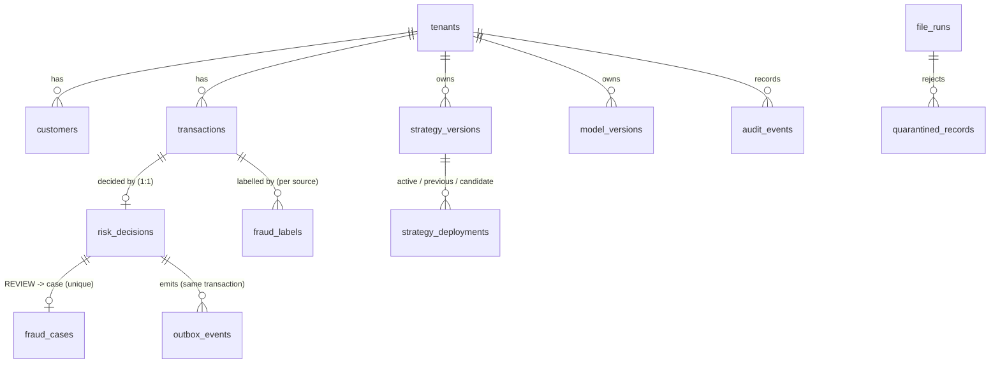

# Database Design

> PostgreSQL 16 is the system of record; Redis holds only reconstructable derived state (ADR-003). Schema is
> managed with Flyway in two independent histories: `decision-service` (`db/migration`, V1–V6) and
> `file-adapter` (`db/ingestion`, V1). Everything here is implemented; troubleshooting numbers come from the lab.

## 1. Data model



| Table | Purpose | Key constraints |
|---|---|---|
| `tenants` | Customers of the platform (multi-tenant) | PK `tenant_id` |
| `customers` | Customer profile snapshot (from CRM API, batch files, events) | PK `(tenant_id, customer_id)`; CHECKs on tier, tenure, amounts |
| `transactions` | Every scored or batch-ingested transaction | PK `(tenant_id, transaction_id)`; CHECKs: card payments need `card_token` + `merchant_id`, transfers need `beneficiary_id`; `source` REALTIME/BATCH |
| `risk_decisions` | One decision per transaction, with scores, reasons, feature vector, versions, degraded modes, latency | PK `decision_id`; UNIQUE `(tenant_id, transaction_id)`; FK to `transactions`; `channel` added in V6 (release 2.0) |
| `idempotency_keys` | Idempotent scoring (`client_id` + `Idempotency-Key`) with request hash and stored response | PK `(client_id, idempotency_key)`; status IN_PROGRESS/COMPLETED |
| `strategy_versions` | Versioned strategy documents (rules, thresholds, lists, channel policies) as JSON | PK `(tenant_id, version)`; semantic-version CHECK; status DRAFT/VALIDATED/RETIRED |
| `strategy_deployments` | What is active per environment, previous version, canary candidate + % | PK `(tenant_id, environment)`; FKs to versions; `row_version` for optimistic locking (If-Match) |
| `model_versions` | Model registry: CANDIDATE → SHADOW → CHAMPION → RETIRED | **partial unique index**: one CHAMPION per tenant |
| `audit_events` | Who changed what, before/after JSON, correlation ID | index `(tenant_id, entity_type, entity_id, created_at DESC)` |
| `fraud_cases` | Investigation cases for REVIEW decisions | UNIQUE `decision_id` (duplicate events cannot create two cases); queue index |
| `fraud_labels` | Chargebacks, analyst outcomes, customer reports, batch labels | PK `(tenant_id, transaction_id, source)` → idempotent upserts |
| `outbox_events` | Transactional outbox for Kafka | partial index on unpublished rows |
| `processed_events` | Consumer de-duplication | PK `(consumer_group, event_id)` |
| `integration_failures` | Failed outbound calls for follow-up | partial index on unresolved |
| `file_runs`, `quarantined_records`, `ingested_keys`, `reconciliation_records` | File ingestion (file-adapter schema) | partial unique indexes: same content or same file identity cannot complete twice |
| `reporting.v_decisions`, `reporting.v_labels` | Read-only views for BI extracts | – |

**Design choices that differ from a textbook model (and why).**
* **No separate `accounts` table.** `account_id` is an attribute of the transaction. Account master data belongs
  to the customer's core banking system; the platform needs the identifier for velocity and linking, not the
  account lifecycle. Adding it would create a second, stale copy of the customer's data.
* **Rules are not rows.** Rules, thresholds and lists live inside a versioned strategy document
  (`strategy_versions.definition`). A strategy is validated, approved, deployed and rolled back **as a unit**;
  row-per-rule tables make "which exact rule set decided this transaction?" much harder to answer.
  Every decision stores `strategy_version` (and the strategy checksum is visible in health).
* **Decisions store the feature vector.** Makes every decision explainable and re-playable (simulation of a
  new strategy against recent traffic, TS-13), at the cost of row width (~1.5 KB). That width is exactly what made
  the release 2.0 backfill expensive (MIGRATION runbook §6).

## 2. Transactions (unit of work)

Scoring one transaction commits **one** database transaction containing: the `transactions` row, the
`risk_decisions` row, the completed `idempotency_keys` response and the `outbox_events` rows. Consequences:
* no decision without its events (no dual write to Kafka; the relay publishes later, NFR-04, verified in the
  degradation test: 34,768 responses = 34,768 persisted decisions);
* a retry with the same `Idempotency-Key` returns the stored response;
* the transaction must stay short: TS-02 showed what 400 ms of extra work inside it does (pool exhaustion).

The outbox relay claims rows with `FOR UPDATE SKIP LOCKED`, so several instances can relay in parallel without
double-publishing the same batch.

## 3. Indexes and the queries they serve

| Index | Query | Evidence |
|---|---|---|
| `ix_decisions_tenant_created (tenant_id, created_at DESC, decision_id DESC)` | Keyset pagination of decisions (analyst UI, exports); backfill cursor | TS-01: 0.18 ms with the index, 66 ms (parallel seq scan) without |
| `ix_decisions_review_queue … WHERE decision = 'REVIEW'` | Review queue | partial index: only ~REVIEW rows |
| `ix_transactions_customer_time`, `…card_time`, `…device_time` (partial) | PostgreSQL fallback for velocity features when Redis is down | TS-12 bounded fallback |
| `uq_model_champion … WHERE status = 'CHAMPION'` | Enforces a single champion | constraint, not a query |
| `ix_outbox_unpublished … WHERE published_at IS NULL` | Relay polling | stays tiny: backlog ≤ 12 rows at 150 TPS |
| `ix_cases_queue`, `ix_audit_entity`, `ix_labels_received`, `ix_recon_category` | Queue, audit history, label ingestion, reconciliation reports | – |

**Pagination is keyset, not OFFSET:** `WHERE (created_at, decision_id) < (?, ?) ORDER BY created_at DESC,
decision_id DESC LIMIT n`. Cost is constant per page; OFFSET scans and discards all previous rows.

## 4. Connection pool and timeouts

| Setting | Value | Reason / evidence |
|---|---|---|
| HikariCP `maximum-pool-size` | 20 (`DB_POOL_MAX`) | 0 pending at 150 TPS (Stage 8); Little's law check in TS-02 |
| `connection-timeout` | 1 s | fail fast; a request must not wait seconds for a connection |
| `leak-detection-threshold` | 5 s | logs connections held longer than 5 s ("leaked connection … returned to the pool" entries appeared in lab logs) |
| `statement_timeout` (connection option) | 2 s | guard for the hot path; admin/reporting queries set their own (`SET LOCAL`, J-36) |
| PostgreSQL `max_connections` | 200 | instances × pool size + admin headroom |
| Lettuce (Redis) pool | 16 connections | J-26: without a pool every pipeline opened a TCP connection |

## 5. Migrations

Rules (also in MENTORING_AND_ENGINEERING_STANDARDS.md): additive changes first (expand), data backfill as a
separate, throttled, idempotent job, destructive or constraining changes a release later (contract); never edit
an applied migration; `lock_timeout` on DDL; test against production-sized data.

| Version | Change | Note |
|---|---|---|
| V1 | Core schema | – |
| V2 | Strategies, models, audit | – |
| V3 | Canary rollout columns + index | – |
| V4 | Cases, labels, outbox, processed events, integration failures | – |
| V5 | Reporting views | – |
| V6 | `risk_decisions.channel` (expand) | release 2.0, rehearsed on ~600k rows |
| V7 (pending) | `channel NOT NULL` (contract) | `db/pending/`, gated on reconciliation |

Broken-migration handling: TS-17 (failed `NOT NULL` on a populated table, rolled back by transactional DDL).

## 6. Troubleshooting toolkit (used in the lab)

```sql
-- top statements by mean time (pg_stat_statements enabled in compose)
SELECT calls, round(mean_exec_time::numeric,2) AS mean_ms, left(query,80) FROM pg_stat_statements ORDER BY mean_exec_time DESC LIMIT 10;
-- what is running / waiting right now
SELECT pid, state, wait_event_type, wait_event, now()-xact_start AS xact_age, left(query,60) FROM pg_stat_activity WHERE datname='riskplatform';
-- plan with real timings and buffers
EXPLAIN (ANALYZE, BUFFERS) SELECT … ;
-- index usage and bloat indicators
SELECT relname, n_live_tup, n_dead_tup, last_autovacuum FROM pg_stat_user_tables ORDER BY n_dead_tup DESC;
SELECT indexrelname, idx_scan FROM pg_stat_user_indexes WHERE relname = 'risk_decisions';
```
`log_min_duration_statement=200` and `log_checkpoints=on` are set in compose; they were what identified the
backfill's effect (COMMIT up to 1.5 s) in the migration rehearsal.

| Lab case | Symptom | Finding |
|---|---|---|
| TS-01 | Listing API 15 → 70 ms | missing index → parallel seq scan |
| TS-02 | 17.5% failed requests, DB looks idle | connections held by slow in-transaction work; PG shows them as `idle` (lazy BEGIN) |
| J-12 | 503 "database unavailable" for a SQL defect | untyped parameter; only transient errors map to 503 |
| J-36 | Reconciliation 503 after backfill | 2 s statement timeout + dead tuples |
| J-37 | VACUUM failed | Docker `/dev/shm` 64 MB |
| Migration §6 | p99 ×14 during backfill | whole-row rewrites → WAL volume; throttle by effect |

## 7. NoSQL component: Redis

Used for velocity windows (sorted sets per card/account/device), "seen before" sets (devices, beneficiaries) and
precomputed graph risk (hashes). Why Redis: sub-millisecond reads for 3 pipelined round trips per decision, TTLs
that match feature windows, and data that can be **rebuilt from PostgreSQL** (rebuild endpoint: 316,607
transactions in ~55 s). Why not the system of record: no durable audit or relational constraints are needed there.
Lessons: connection lifecycle matters (J-26); losing the state is silent unless monitored (TS-18); persistence
settings must be known, not assumed (J-30).

## 8. Limitations / future improvements
* No partitioning yet: `risk_decisions` grows unbounded; monthly range partitions on `created_at` (with the
  channel column enabling per-channel reporting) and a retention policy are the next step.
* No read replica for reporting; BI extracts run on the primary.
* Row width: storing the full feature vector as JSONB is convenient but expensive to rewrite; a compact binary
  or separate cold table could be considered.
* Backups and PITR are infrastructure concerns (RDS); the lab only exercised `pg_dump`.
