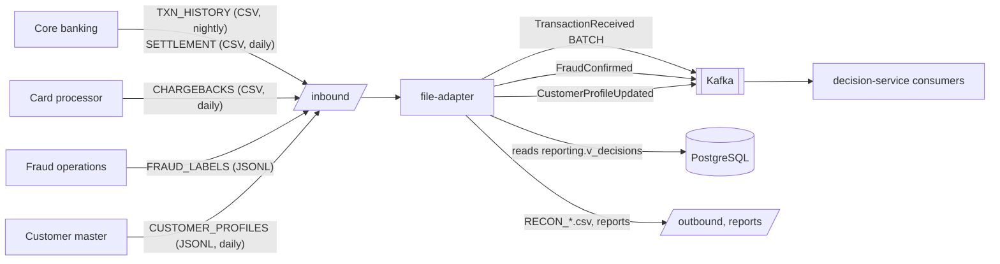

# File Integrations (Legacy Systems)

> Implemented in Stage 7 (`risk-platform/file-adapter`). File formats, systems and data are fictional;
> sample files are generated by the ML workbench (`fraudlab.cli files`) into `data/samples/files/`.

## 1. Why a separate file adapter
Aldermoor's core banking, card processor and customer master cannot call APIs or publish events; they
exchange files. File ingestion has a different profile from real-time scoring — throughput over latency,
restartability over immediacy — so it runs as its own service and never competes for scoring threads.
It owns its own schema (`ingestion`) and **never writes decision-service tables**: results flow as events,
and reconciliation reads the `reporting` views (a published, read-only contract).



## 2. File catalogue

| Type | Source | Format | Natural key (duplicates) | Result | Max invalid ratio |
|---|---|---|---|---|---|
| `TXN_HISTORY` | Core banking | CSV | transaction_id | `TransactionReceived` (source=BATCH) → persisted as BATCH, folded into the feature store | 5% |
| `CHARGEBACKS` | Card processor | CSV | transaction_id | `FraudConfirmed` (CHARGEBACK) → labels | 5% |
| `FRAUD_LABELS` | Fraud operations | JSONL | transaction_id + source | `FraudConfirmed` (CUSTOMER_REPORT / BATCH_LABEL) | 5% |
| `CUSTOMER_PROFILES` | Customer master | JSONL | customer_id + business date | `CustomerProfileUpdated` → profile replica | 2% |
| `SETTLEMENT` | Core banking | CSV | transaction_id | Reconciliation against decisions | 1% |

### Naming and completeness
* Name: `<TYPE>_<tenant>_<yyyyMMdd>_<seq>.<csv|jsonl>`, e.g. `TXN_HISTORY_aldermoor-bank_20260430_001.csv`.
* Completeness marker `<name>.done`, written by the sender **after** the data file:
  ```
  records=600
  sha256=cc3c4c15ae3117fb3a4ca3eb78a477cd9baf7534d900b19b6d6dc144ff846200
  ```
  No marker → file ignored until it appears (still being transferred). Count or checksum mismatch → `FILE_INCOMPLETE`.

### CSV header (must match exactly, in order)
`TXN_HISTORY`: `transaction_id,event_time,customer_id,account_id,transaction_type,channel,amount,currency,card_token,merchant_id,mcc,merchant_country,beneficiary_id,beneficiary_country,device_id,ip_address,ip_country`

`CHARGEBACKS`: `transaction_id,chargeback_date,reason_code,amount,currency,customer_id`

`SETTLEMENT`: `transaction_id,settlement_date,settled_amount,currency,status`

Encoding UTF-8 (a leading BOM is tolerated), RFC 4180 quoting, `.` decimal separator, ISO-8601 UTC timestamps.

## 3. Processing pipeline

| Step | Check | Failure outcome |
|---|---|---|
| 1 | File name matches the contract, known tenant | `REJECTED: UNKNOWN_FILE_NAME / UNKNOWN_TENANT` → `rejected/` |
| 2 | `.done` present; record count and SHA-256 match | wait / `REJECTED: FILE_INCOMPLETE` |
| 3 | Content already processed (SHA-256) | `REJECTED: DUPLICATE_FILE` |
| 4 | Same name already completed with different content | `REJECTED: DUPLICATE_FILE_NAME` (corrections need a new sequence) |
| 5 | Claim run (DB unique index — safe with several instances) | skipped by the other instance |
| 6 | Header equals the agreed spec | `REJECTED: SCHEMA_MISMATCH` (expected vs actual in the report) |
| 7 | Per-record validation (required, types, enums, ISO codes, decimals, raw-PAN guard, business rules) | record → `quarantine/` + `ingestion.quarantined_records` (line, raw, errors) |
| 8 | Duplicates within the file and across files (`ingestion.ingested_keys`) | counted, skipped |
| 9 | Invalid ratio > threshold | `REJECTED: TOO_MANY_INVALID_RECORDS` — systemic problem, nothing published |
| 10 | Publish events (deterministic IDs) / reconcile | `FAILED: PUBLISH_FAILED` → file returned to `inbound/`, retried |
| 11 | Record ingested keys, report, archive | `COMPLETED` or `COMPLETED_WITH_ERRORS` |

### Partial-failure policy
Below the threshold, valid records are processed and invalid ones are quarantined with line numbers and
reasons for the sender to correct and resend (with a new sequence number). Above it, the whole file is
rejected: 30% bad rows usually means the wrong export, a changed format or a decimal-comma locale — not
30 individual data-entry mistakes — and partially loading it would create a reconciliation mess.

### Idempotency without an outbox
The file is the durable, replayable source, so the adapter publishes directly with the idempotent
producer and waits for acks. Event IDs are **deterministic** — `UUID.nameUUIDFromBytes(tenant|type|naturalKey)`
— so re-processing a file after a crash or a publish failure emits the *same* event IDs and consumers
de-duplicate them. Record-level `ingested_keys` are written only after successful publication.

## 4. Reconciliation (settlement vs decisions)

| Category | Meaning | Action |
|---|---|---|
| `MATCHED` | Approved/reviewed, settled, same amount | — |
| `AMOUNT_MISMATCH` | Settled amount ≠ scored amount (e.g. partial capture, currency conversion) | Investigate if above tolerance |
| `SETTLED_BUT_DECLINED` | **Critical**: platform declined, core settled — decline not enforced by a channel | Incident; check channel integration |
| `NOT_SCORED` | **Critical**: settled but never scored — a channel bypasses fraud checks | Incident; integration gap |
| `APPROVED_NOT_SETTLED` | Approved on the business date, absent from settlement | Timing (T+1/T+2) or lost message; re-check next day |
| `REVERSED` | Reversal | Informational |

Outputs: `ingestion.reconciliation_records`, `outbound/RECON_<tenant>_<date>.csv`, summary in the run report,
`GET /v1/reconciliation/{tenant}/{date}?category=`.

## 5. Operations

```bash
curl -H 'X-Api-Key: dev-file-ops-key' localhost:8081/v1/ingestion/runs?tenant=aldermoor-bank
curl -H 'X-Api-Key: dev-file-ops-key' localhost:8081/v1/ingestion/runs/<runId>      # report + quarantined sample
curl -X POST -H 'X-Api-Key: dev-file-ops-key' localhost:8081/v1/ingestion/scan       # scan now
curl -H 'X-Api-Key: dev-file-ops-key' 'localhost:8081/v1/reconciliation/aldermoor-bank/2026-04-30?category=SETTLED_BUT_DECLINED'
```

Directories (under `FILES_DIR`, default `data/runtime/files`): `inbound/ processing/ archive/<date>/ rejected/
quarantine/ reports/ outbound/`. Metrics: `ingestion_files_total{type,status}`,
`ingestion_records_total{type,outcome}`, `ingestion_scan_errors_total`.

Stale runs: an instance that crashes leaves a `PROCESSING` row; after 15 minutes another instance takes over.

### Alerting (recommended)
* Expected file missing by its SLA time (e.g. `TXN_HISTORY` by 06:00) — most important legacy alert.
* Any `REJECTED` file; `COMPLETED_WITH_ERRORS` with quarantine > 0.5%.
* Any `SETTLED_BUT_DECLINED` or `NOT_SCORED` record.
* `ingestion_scan_errors_total` increasing.

## 6. AWS mapping
`inbound/` → S3 prefix with event notifications → SQS → adapter (instead of polling); `archive/` → S3 with
lifecycle to Glacier; `quarantine/`, `reports/`, `outbound/` → S3 prefixes; SFTP senders → AWS Transfer Family
writing to S3; the `.done` convention stays (or S3 object tags / manifest files).

## 7. Tests (`FileAdapterIntegrationTest`, 13 tests, PostgreSQL + Kafka)
Valid file published with deterministic IDs and archived · duplicate content rejected · schema mismatch ·
partial quarantine with line numbers (negative amount, raw PAN) · too many invalid records · incomplete
transfer and missing marker · cross-file record duplicates · chargebacks/labels → FraudConfirmed, invalid
JSON quarantined · profiles → CustomerProfileUpdated · settlement reconciliation (all categories, outbound
file, API) · ops API authentication · **all workbench sample files accepted** · **each broken sample rejected
for the documented reason**. Decision-service side (`MessagingIntegrationTest`): batch history persisted and
warms the feature store (device no longer "new"); profile updates refresh the replica.

## 8. Limitations
* Polling scan locally; S3 notifications in production.
* One file at a time per instance; very large files would need streaming validation and chunked publishing.
* No PGP decryption / signature verification of inbound files (common bank requirement; roadmap).
* Reconciliation tolerance is exact-amount; FX and partial captures need a configurable tolerance.

## 9. Interview talking points
* "A file is an integration contract like an API: naming, completeness marker, schema version, checksum, and
  an explicit policy for what happens with bad records."
* "Below 5% invalid I quarantine and continue; above it I reject the whole file — at that point it's a format
  problem, not bad data, and partial loads make reconciliation painful."
* "The adapter doesn't need an outbox: the file is the replayable source, and deterministic event IDs make a
  re-run idempotent downstream."
* "The most valuable reconciliation categories are SETTLED_BUT_DECLINED and NOT_SCORED — they find channels
  that bypass or ignore the fraud decision."
