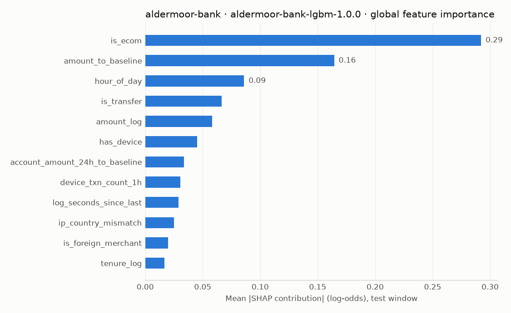

# Explanations — aldermoor-bank — model aldermoor-bank-lgbm-1.0.0 — strategy 1.1.0

> Synthetic data, test window. SHAP contributions are in log-odds; positive values push towards fraud.

## Why two similar transactions received different decisions

### Card payment (e-commerce)

| Transaction | Ground truth | Decision | Amount | Risk | Model p | Graph | Anomaly pct | Rules hit | Top model reasons (SHAP, log-odds) |
|---|---|---|---|---|---|---|---|---|---|
| ALD-T000625747 | fraud_ring | **REVIEW** | 416.84 | 0.862 | 0.6263 | 1.0 | 0.9991 | MCC-001 | CUSTOMER_BEHAVIOR_DEVIATION (amount_to_baseline=33.321, +3.527), CUSTOMER_PROFILE (tenure_log=4.111, +1.751), UNUSUAL_TIME (hour_of_day=4.0, +1.041) |
| ALD-T000639688 | legitimate | **APPROVE** | 444.31 | 0.003 | 0.0034 | 0.0 | 0.8201 | - | CUSTOMER_BEHAVIOR_DEVIATION (amount_to_baseline=19.168, +1.664), CUSTOMER_BEHAVIOR_DEVIATION (amount_log=6.099, +0.186), NEW_DEVICE (has_device=1.0, +0.036) |

### Account-to-account transfer

| Transaction | Ground truth | Decision | Amount | Risk | Model p | Graph | Anomaly pct | Rules hit | Top model reasons (SHAP, log-odds) |
|---|---|---|---|---|---|---|---|---|---|
| ALD-T000625682 | account_takeover | **REVIEW** | 130.98 | 0.678 | 0.0067 | 0.5 | 0.9791 | DEV-001, DEV-002, BEN-001, TIM-001 | NEW_DEVICE (is_new_device=1.0, +3.574), NEW_BENEFICIARY (is_new_beneficiary=1.0, +0.115), NEW_DEVICE (has_device=1.0, +0.11) |
| ALD-T000625706 | legitimate | **APPROVE** | 115.20 | 0.001 | 0.0006 | 0.0 | 0.9298 | - | UNUSUAL_TIME (hour_of_day=2.0, +1.136), NEW_DEVICE (has_device=1.0, +0.154), CUSTOMER_BEHAVIOR_DEVIATION (amount_log=4.755, +0.101) |

### Card payment (in store)

| Transaction | Ground truth | Decision | Amount | Risk | Model p | Graph | Anomaly pct | Rules hit | Top model reasons (SHAP, log-odds) |
|---|---|---|---|---|---|---|---|---|---|
| ALD-T000685205 | geo_counterfeit | **REVIEW** | 81.14 | 0.81 | 0.6716 | 0.0 | 0.9884 | GEO-001, GEO-002 | UNUSUAL_LOCATION (card_country_change_1h=1.0, +5.17), UNUSUAL_LOCATION (is_foreign_merchant=1.0, +2.772), CUSTOMER_BEHAVIOR_DEVIATION (amount_to_baseline=3.246, +0.536) |
| ALD-T000625779 | legitimate | **APPROVE** | 90.51 | 0.0 | 0.0003 | 0.0 | 0.8926 | - | UNUSUAL_TIME (hour_of_day=5.0, +0.674), UNUSUAL_TIME (is_night=1.0, +0.037), HIGH_TRANSACTION_VELOCITY (account_txn_count_24h=0.0, +0.019) |

## Highest-scoring false positives (genuine customers we flagged)

| Transaction | Ground truth | Decision | Amount | Risk | Model p | Graph | Anomaly pct | Rules hit | Top model reasons (SHAP, log-odds) |
|---|---|---|---|---|---|---|---|---|---|
| ALD-T000653097 | legitimate | **DECLINE** | 261.88 | 0.908 | 0.845 | 0.0 | 0.9991 | GEO-002 | UNUSUAL_LOCATION (is_foreign_merchant=1.0, +4.883), CUSTOMER_BEHAVIOR_DEVIATION (amount_to_baseline=4.9, +1.883), CUSTOMER_BEHAVIOR_DEVIATION (log_seconds_since_last=6.006, +1.247) |
| ALD-T000751648 | legitimate | **REVIEW** | 128.11 | 0.829 | 0.7547 | 0.0 | 0.9976 | - | UNUSUAL_LOCATION (is_foreign_merchant=1.0, +4.884), CUSTOMER_BEHAVIOR_DEVIATION (amount_to_baseline=5.926, +1.713), CUSTOMER_BEHAVIOR_DEVIATION (log_seconds_since_last=5.688, +1.18) |
| ALD-T000758521 | legitimate | **REVIEW** | 75.20 | 0.789 | 0.7581 | 0.0 | 0.9915 | GEO-002 | UNUSUAL_LOCATION (is_foreign_merchant=1.0, +4.797), CUSTOMER_BEHAVIOR_DEVIATION (amount_to_baseline=5.697, +1.84), CUSTOMER_BEHAVIOR_DEVIATION (log_seconds_since_last=7.408, +1.158) |

## Lowest-scoring false negatives (fraud we approved)

| Transaction | Ground truth | Decision | Amount | Risk | Model p | Graph | Anomaly pct | Rules hit | Top model reasons (SHAP, log-odds) |
|---|---|---|---|---|---|---|---|---|---|
| ALD-T000768565 | account_takeover | **APPROVE** | 68.36 | 0.0 | 0.0002 | 0.0 | 0.8528 | - | HIGH_TRANSACTION_VELOCITY (device_txn_count_1h=1.0, +0.311), CUSTOMER_BEHAVIOR_DEVIATION (log_seconds_since_last=6.833, +0.03), NEW_DEVICE (has_device=1.0, +0.03) |
| ALD-T000628245 | account_takeover | **APPROVE** | 170.19 | 0.0 | 0.0002 | 0.0 | 0.8638 | - | HIGH_TRANSACTION_VELOCITY (device_txn_count_1h=1.0, +0.333), CUSTOMER_BEHAVIOR_DEVIATION (log_seconds_since_last=3.749, +0.032), NEW_DEVICE (has_device=1.0, +0.029) |
| ALD-T000664840 | account_takeover | **APPROVE** | 123.06 | 0.0 | 0.0003 | 0.0 | 0.849 | - | HIGH_TRANSACTION_VELOCITY (device_txn_count_1h=1.0, +0.336), CUSTOMER_PROFILE (tenure_log=7.806, +0.041), NEW_DEVICE (has_device=1.0, +0.037) |
