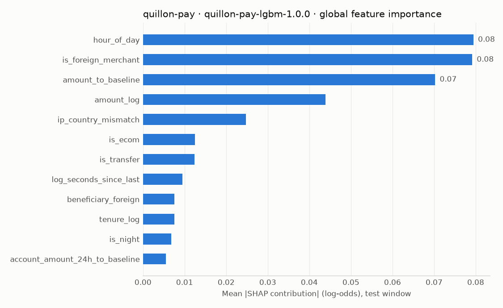

# Explanations — quillon-pay — model quillon-pay-lgbm-1.0.0 — strategy 1.1.0

> Synthetic data, test window. SHAP contributions are in log-odds; positive values push towards fraud.

## Why two similar transactions received different decisions

### Card payment (e-commerce)

| Transaction | Ground truth | Decision | Amount | Risk | Model p | Graph | Anomaly pct | Rules hit | Top model reasons (SHAP, log-odds) |
|---|---|---|---|---|---|---|---|---|---|
| QPY-T000382964 | stolen_card | **DECLINE** | 595.32 | 0.947 | 0.8673 | 0.0 | 0.9993 | GEO-001, MCC-001 | UNUSUAL_LOCATION (is_foreign_merchant=1.0, +4.928), UNUSUAL_LOCATION (card_country_change_1h=1.0, +1.401), UNUSUAL_LOCATION (ip_country_mismatch=0.0, +1.122) |
| QPY-T000385134 | legitimate | **APPROVE** | 669.75 | 0.036 | 0.0008 | 0.0 | 0.7628 | MCC-001 | CUSTOMER_BEHAVIOR_DEVIATION (amount_to_baseline=5.15, +0.107), CUSTOMER_BEHAVIOR_DEVIATION (amount_log=6.508, +0.08), HIGH_RISK_MERCHANT (mcc_high_risk=1.0, +0.005) |

### Account-to-account transfer

| Transaction | Ground truth | Decision | Amount | Risk | Model p | Graph | Anomaly pct | Rules hit | Top model reasons (SHAP, log-odds) |
|---|---|---|---|---|---|---|---|---|---|
| QPY-T000387838 | fraud_ring | **REVIEW** | 523.80 | 0.868 | 0.5847 | 1.0 | 0.9998 | BEH-001 | UNUSUAL_LOCATION (ip_country_mismatch=1.0, +2.881), NEW_BENEFICIARY (beneficiary_foreign=1.0, +1.993), CUSTOMER_BEHAVIOR_DEVIATION (amount_to_baseline=27.0, +1.791) |
| QPY-T000383235 | legitimate | **APPROVE** | 456.76 | 0.002 | 0.0016 | 0.0 | 0.9547 | - | CUSTOMER_BEHAVIOR_DEVIATION (amount_to_baseline=15.499, +0.763), CUSTOMER_BEHAVIOR_DEVIATION (log_seconds_since_last=7.679, +0.118), UNUSUAL_TIME (hour_of_day=6.0, +0.049) |

### Card payment (in store)

| Transaction | Ground truth | Decision | Amount | Risk | Model p | Graph | Anomaly pct | Rules hit | Top model reasons (SHAP, log-odds) |
|---|---|---|---|---|---|---|---|---|---|
| QPY-T000433387 | geo_counterfeit | **REVIEW** | 233.70 | 0.838 | 0.6484 | 0.0 | 0.9987 | GEO-001 | UNUSUAL_LOCATION (is_foreign_merchant=1.0, +4.004), UNUSUAL_LOCATION (card_country_change_1h=1.0, +2.018), UNUSUAL_LOCATION (ip_country_mismatch=0.0, +1.765) |
| QPY-T000393111 | legitimate | **APPROVE** | 214.64 | 0.336 | 0.0013 | 0.0 | 0.9992 | - | CUSTOMER_BEHAVIOR_DEVIATION (amount_to_baseline=7.378, +0.277), CUSTOMER_BEHAVIOR_DEVIATION (amount_log=5.374, +0.124), CUSTOMER_PROFILE (tenure_log=3.664, +0.081) |

## Highest-scoring false positives (genuine customers we flagged)

| Transaction | Ground truth | Decision | Amount | Risk | Model p | Graph | Anomaly pct | Rules hit | Top model reasons (SHAP, log-odds) |
|---|---|---|---|---|---|---|---|---|---|
| QPY-T000415321 | legitimate | **REVIEW** | 508.95 | 0.779 | 0.6574 | 0.2 | 0.9969 | BEH-001, MCC-001 | UNUSUAL_LOCATION (is_foreign_merchant=1.0, +2.751), UNUSUAL_LOCATION (ip_country_mismatch=1.0, +1.784), CUSTOMER_BEHAVIOR_DEVIATION (amount_to_baseline=12.778, +1.396) |
| QPY-T000406619 | legitimate | **REVIEW** | 726.65 | 0.607 | 0.5222 | 0.0 | 0.9969 | MCC-001 | UNUSUAL_LOCATION (is_foreign_merchant=1.0, +5.103), UNUSUAL_LOCATION (ip_country_mismatch=0.0, +1.731), CUSTOMER_BEHAVIOR_DEVIATION (amount_to_baseline=14.615, +0.822) |
| QPY-T000445981 | legitimate | **REVIEW** | 2017.19 | 0.404 | 0.0045 | 0.4 | 0.9971 | BEN-003, BEH-001 | CUSTOMER_BEHAVIOR_DEVIATION (amount_to_baseline=22.143, +1.234), CUSTOMER_PROFILE (tenure_log=4.234, +0.464), CUSTOMER_BEHAVIOR_DEVIATION (amount_log=7.61, +0.183) |

## Lowest-scoring false negatives (fraud we approved)

| Transaction | Ground truth | Decision | Amount | Risk | Model p | Graph | Anomaly pct | Rules hit | Top model reasons (SHAP, log-odds) |
|---|---|---|---|---|---|---|---|---|---|
| QPY-T000457388 | account_takeover | **APPROVE** | 88.81 | 0.001 | 0.0007 | 0.0 | 0.9734 | - | HIGH_TRANSACTION_VELOCITY (device_txn_count_1h=2.0, +0.009), CUSTOMER_BEHAVIOR_DEVIATION (log_seconds_since_last=5.678, +0.009), CUSTOMER_BEHAVIOR_DEVIATION (account_amount_24h_to_baseline=13.232, +0.001) |
| QPY-T000457384 | account_takeover | **APPROVE** | 80.59 | 0.001 | 0.0007 | 0.0 | 0.9033 | - | CUSTOMER_BEHAVIOR_DEVIATION (log_seconds_since_last=7.041, +0.008), HIGH_TRANSACTION_VELOCITY (device_txn_count_1h=1.0, +0.007), CUSTOMER_BEHAVIOR_DEVIATION (account_amount_24h_to_baseline=9.918, +0.002) |
| QPY-T000454864 | account_takeover | **APPROVE** | 154.05 | 0.001 | 0.0007 | 0.0 | 0.821 | - | CUSTOMER_BEHAVIOR_DEVIATION (amount_log=5.044, +0.092), CUSTOMER_BEHAVIOR_DEVIATION (log_seconds_since_last=7.186, +0.035), CUSTOMER_BEHAVIOR_DEVIATION (account_amount_24h_to_baseline=7.021, +0.008) |
